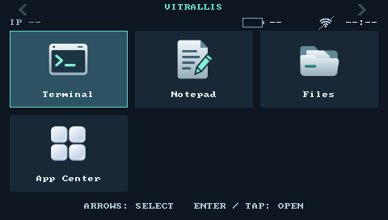

# Vitrallis Shell

**Small screens. Big possibilities.**

A compact Rust + SDL2 launcher for small Linux screens. Open a terminal, jot down a note, browse your files, and make a small screen feel useful again. Vitrallis runs inside your existing desktop session.

[](https://github.com/csd113/Vitrallis-Shell/actions/workflows/validate.yml) [](https://github.com/csd113/Vitrallis-Shell/releases)



*Current desktop build rendered at 480×272; hardware status is unavailable.*

- **Three native essentials:** Terminal with a real PTY, a text-editing Notepad, and Files for browsing and everyday file operations. All ship with the shell and work offline.
- **Room to explore:** App Center checks GitHub catalogs and installs selected manifest packages, with source trust, checksums, and local-edit protection.
- **Keys or touch:** visible selection and shared activation across native controls, with confirmations for destructive actions.
- **Optional system integration:** brightness, volume, status, Wi-Fi utility access, and a supervised session that restores the original Home binding on exit.
- **Whole-build updates:** System Settings updates the shell and all three native utilities together when a compatible newer release is available.

## Installation

**Beta.** Install the complete bundle containing the shell, Terminal, Notepad and Files.
See [device installation and recovery](docs/devices/pocketchip.md) for supported
OS/runtime requirements, setup commands and hardware validation limits. The current
source changes require a matching bundle and helpers; the bootstrap refuses earlier releases
without the current session installer.

## First launch and controls

After installation, run `~/.local/share/vitrallis/launch` from a terminal in the existing graphical session.

| Action | Control |
| --- | --- |
| Select an app | Arrow keys |
| Open or resume it | Enter, click, or tap |
| Change page | Page Up / Page Down or header arrows |
| Return from an app | Home in a supervised session |
| Return to the original home | Select **Exit Vitrallis** in a supervised session |
| Update the native build | System Settings → More → Check for Updates |

Running apps remain open when you return Home. Save and close them before stopping or removing the session. Native utility menus and dialogs have visible keyboard focus; see [Terminal, Notepad and Files controls](docs/native-apps.md). App Center has [its own navigation and package guide](docs/app-center.md).

Use **Actions → Add shortcut** (F2) to launch ordinary Linux programs or scripts without an
App Center package. See [desktop shortcuts](docs/desktop-shortcuts.md) for command
quoting, terminal mode, icons, editing, and removal rules.

## Compatibility and beta limits

Linux release packaging targets x86-64 and ARMv7, with glibc 2.36+ and SDL2
2.26.5+. macOS is a development host; Linux artifacts cannot install there.
The shell uses SDL hardware acceleration when available, with automatic software
fallback and a GLES2 compatibility floor. See [renderer selection and diagnostics](docs/shell.md#sdl-renderer-selection)
for overrides and GPU validation limits. Hardware support requires a matching adapter and validation. A matching screen
size alone is not support. See the [device guide](docs/devices/pocketchip.md) for
recorded evidence and checks still requiring hardware.

Apps run with your user's permissions: **Vitrallis is not an app sandbox**. Catalog availability and runtime dependencies belong to each publisher. Some packages are disabled by their publisher. Fonts do not provide full Unicode shaping; Bluetooth controls, a public Python SDK, and signed publisher packages are future work. See the [trust model](docs/security.md) and [design roadmap](docs/design.md).

## Documentation and development

Start with the [documentation index](docs/README.md), [device guide](docs/devices/pocketchip.md), or [app developer guide](docs/app-development.md).

Host development uses the pinned Rust 1.91.1 toolchain (minimum 1.91), SDL2 development libraries, and pkg-config:

```sh
cargo build --workspace --locked
cargo run --locked
sh scripts/validate.sh
```

The workspace build includes all native utilities. [Contributor guidance](CONTRIBUTING.md) covers setup, focused changes, validation, and pull requests. Please use the [bug and feature forms](https://github.com/csd113/Vitrallis-Shell/issues/new/choose) for feedback and the [security reporting policy](SECURITY.md) for security concerns.

**License:** the workspace is marked `LicenseRef-Proprietary` in [Cargo metadata](Cargo.toml). No open-source license grant is included in this repository. Ask the maintainer about reuse; dependency licenses remain their own.

## Uninstall

**Save your work first.** Removal stops only a verified Vitrallis-owned session, closes its apps, and restores temporary Home bindings. Run as the same normal user; no network connection is needed:

```sh
python3 "$HOME/.local/share/vitrallis/uninstall.py"
```

Add `--dry-run` to inspect first. Add `--purge` to also remove the default Vitrallis preferences and session logs; deletion requires typing `PURGE`. Purge still keeps third-party apps, saves, App Center transaction backups, installation backups, user documents, system packages, and the original desktop. Custom XDG locations and edited or unrecognized files are preserved. Matching shortcuts and the exact optional startup block are removed without restoring entire configuration files.

A tiny update lock remains for safe concurrency. After successful removal the uninstaller itself is gone; running the line again reports a missing script and changes nothing. For interrupted or partial installs, retained paths, and the local recovery command, see [offline removal and recovery](docs/devices/pocketchip.md#offline-removal-and-recovery).
