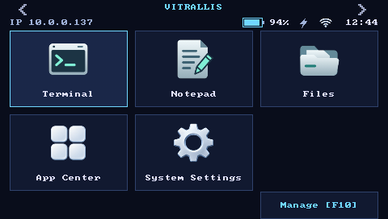
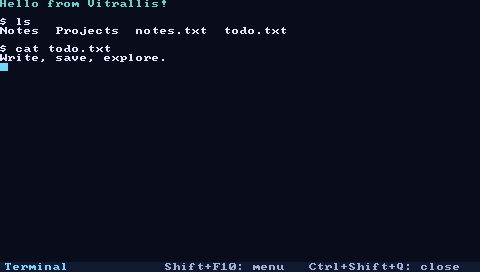
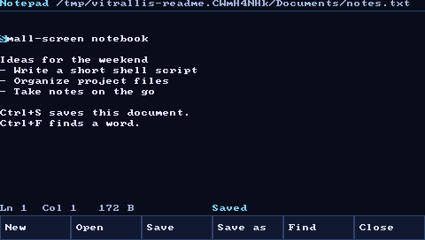
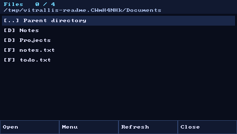
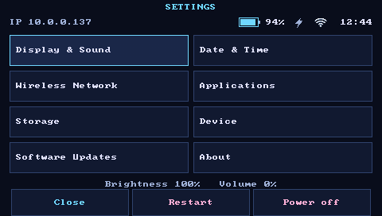
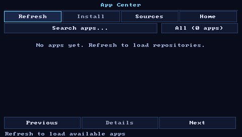

# Vitrallis Shell

A compact Rust + SDL2 launcher for small Linux screens, built around PocketCHIP
and its 480×272 display. Open a terminal, take notes, browse files, and return to
your running apps with the Home key. Vitrallis runs inside the existing desktop
session, with controls for both keyboard and touch.

[](https://github.com/csd113/Vitrallis-Shell/actions/workflows/validate.yml) [](https://github.com/csd113/Vitrallis-Shell/releases)



*Launcher · Vitrallis 1.0.4 on a physical PocketCHIP, 480×272; live battery and Wi-Fi status.*

For PocketCHIP owners and small-screen Linux tinkerers who want a readable,
keyboard-friendly starting point for everyday tools. **The project is still
pre-release:** check the platform and hardware-validation limits below before
installing.

## What you can do

- **Use three offline native apps:** Terminal runs a real PTY with ANSI colors and scrollback; Notepad opens, edits, finds and saves plain text; Files browses, copies, moves, renames and deletes with confirmations.
- **Keep your tools close:** return Home to background an app, then select its tile to resume it. Organize tiles in folders or add shortcuts for ordinary Linux programs and scripts.
- **Browse App Center:** search and filter GitHub catalogs, read package details and release notes, then install, update or remove apps. Source trust checks, checksums and transaction recovery protect managed installs and local edits.
- **Tune the session:** Settings includes display and sound, date and time, wireless and Tor, background-app policy, storage, device controls, software updates and About. Device controls depend on the supported platform and available utilities.
- **Update the complete build:** Software Updates checks for compatible releases and updates the shell and three native apps together with the shared Arti executable. A verified retained build can be restored from the same screen.

## A look inside

Each image is an unaltered **480×272** display capture from a physical PocketCHIP
running the current 1.0.4 build, with isolated sample files. This short screenshot
session is not a full release certification. [Capture details](docs/images/README.md)
record the build, method and limits.

**Terminal** — run shell commands, with ANSI colors and bounded scrollback.



*Terminal · live Bash session, physical PocketCHIP.*

**Notepad** — a small plain-text editor with save, find and unsaved-change protection.



*Notepad · sample notes, physical PocketCHIP.*

**Files** — browse folders and open text in Notepad; file actions live in the menu.



*Files · isolated sample Documents folder, physical PocketCHIP.*

**Settings** — large category buttons with visible keyboard selection.



*Settings · physical PocketCHIP; category overview.*

**App Center** — search, filter and manage packages from configured sources.



*App Center · before first refresh in an isolated profile, physical PocketCHIP; no third-party apps shown.*

## Installation

The current published bundle is [Vitrallis Shell 1.0.4](https://github.com/csd113/Vitrallis-Shell/releases/tag/v1.0.4).
It contains the shell, Terminal, Notepad, Files and the shared Arti executable.
See the [changelog](docs/releases.md#104--reliability-hardening-release) for the
reliability hardening in this release.

**PocketCHIP setup requires Debian 12 or 13 ARMv7 hard-float (`armhf`), the existing
Awesome 4/PocketHome desktop, a systemd user session and sudo access. Original
Jessie is unsupported.** Keep at least 128 MiB free on the system, home and
temporary filesystems; missing packages may need more. Save your work and exit
any running Vitrallis session before setup.

Run the command below as your **normal desktop user**, in Terminal or SSH,
with `curl`, working HTTPS certificates and access to GitHub and Debian repositories.
It prepares missing Debian packages and platform integration with sudo, then
verifies and installs the complete bundle as your user. Read the
[device installation and recovery guide](docs/devices/pocketchip.md) for the
prerequisites, system changes and recovery procedure.

<!-- pocketchip-install-command -->
```sh
(set -eu; PATH=/usr/sbin:/usr/bin:/sbin:/bin; export PATH; umask 077; vitrallis_setup=$(mktemp -d /tmp/vitrallis-entry.XXXXXXXX); trap 'rm -rf "$vitrallis_setup"' 0; trap 'exit 130' 1 2 15; curl -q -fSL --proto '=https' --proto-redir '=https' --max-redirs 5 --connect-timeout 10 --max-time 30 --max-filesize 262144 https://raw.githubusercontent.com/csd113/Vitrallis-Shell/main/integrations/pocketchip/bootstrap.sh -o "$vitrallis_setup/bootstrap.sh"; sh "$vitrallis_setup/bootstrap.sh")
```

Setup replaces PocketHome's launch command with Vitrallis at login. PocketHome
does not run behind the shell. Uninstall restores its original launch command;
SSH and serial login remain available for recovery.

## First launch and controls

Reboot after setup to start Vitrallis in place of PocketHome. It starts
automatically at subsequent desktop logins. For later launches within that
session, use `~/.local/share/vitrallis/launch` or the Home key.

| Action | Control |
| --- | --- |
| Select an app | Arrow keys |
| Open or resume it | Enter, click, or tap |
| Change page | Page Up / Page Down or header arrows |
| Return from an app | Home in a supervised session |
| Manage shortcuts and folders | **Manage [F10]**; F2 adds a shortcut |
| Navigate native dialogs | Tab or Left/Right, then Enter; Escape cancels |
| Leave Vitrallis for Awesome | **Exit Vitrallis** in a supervised session |
| Update or restore the native build | System Settings → Software Updates |

Returning Home backgrounds an app. Apps stay open by default; **Settings →
Applications** can set an automatic background timeout or exempt individual apps.
Save and close them before stopping or removing the session. Destructive dialogs
start on Cancel. Native text entry uses a physical keyboard; these apps do not
supply an on-screen typing keyboard.

See [Terminal, Notepad and Files controls](docs/native-apps.md),
[App Center navigation](docs/app-center.md), and
[desktop shortcuts](docs/desktop-shortcuts.md) for app-specific keys, command
quoting, terminal mode, icons and editing rules.

## Platforms and current limits

- **Linux builds:** release bundles target x86-64 and ARMv7, with glibc 2.36+ and SDL2 2.26.5+. The one-line installer above is specifically for the supported PocketCHIP desktop, not arbitrary Linux machines.
- **Development hosts:** macOS can build and preview the shell and native apps; Linux artifacts cannot install there. Desktop/simulator captures establish software behavior, not device support.
- **Rendering:** SDL hardware acceleration is used when available, with automatic software fallback and a GLES2 compatibility floor. A matching screen size or GPU API alone does not establish hardware support. See [renderer selection](docs/shell.md#sdl-renderer-selection) and [hardware acceleration evidence](docs/hardware-acceleration.md).
- **Physical validation:** 1.0.4 has host and Linux simulator checks plus the limited physical screenshot session above, but no new full PocketCHIP certification. Earlier 1.0.3 installation, cold-start, keyboard, touch and audible-audio results apply to that candidate; see the [readiness report](docs/release-readiness-2026-10-02.md) and [certification record](docs/release-certification-2026-10-02.md#final-public-candidate). The [device guide](docs/devices/pocketchip.md) records OS/runtime boundaries and outstanding hardware checks.
- **App and editor limits:** catalog availability and runtime dependencies belong to each publisher; disabled packages show **Unavailable** with a compatibility note. Notepad handles UTF-8 text up to 1 MiB and has no undo/redo or syntax highlighting. Bitmap fonts do not provide full Unicode shaping. Bluetooth hardware qualification, a public Python SDK and signed publisher packages remain future work.

**Vitrallis is not an app sandbox.** Apps run with your user's permissions;
checksums verify catalog content, not an independent publisher signature. Review
sources before installing. See the [trust model](docs/security.md),
[security reporting policy](SECURITY.md) and [design roadmap](docs/design.md).

## Documentation and development

Start with the [documentation index](docs/README.md),
[device guide](docs/devices/pocketchip.md), or
[app developer guide](docs/app-development.md).
Report bugs and suggestions through the [issue forms](https://github.com/csd113/Vitrallis-Shell/issues/new/choose);
use [SECURITY.md](SECURITY.md) for security concerns.

Host development requires the pinned Rust 1.99.0 toolchain, SDL2 development
libraries and pkg-config. CI also validates latest stable. See
[contributor setup](CONTRIBUTING.md) and [compiler policy](docs/dependencies.md).
Build the workspace so the three native apps are available beside the shell:

```sh
cargo build --workspace --locked
cargo run --locked -- --size 480x272
sh scripts/validate.sh
cargo build --workspace --release --locked
```

The validation script runs formatting, strict Clippy, Rust/Python tests, release
builds and SDL smoke checks. [Validation guidance](docs/validation.md) covers
visual checks and Linux simulators; system controls in a desktop preview may be
unavailable.

**License:** project-owned code and documentation use [MIT](LICENSE).
[Third-party notices](THIRD_PARTY_NOTICES.md) record dependency terms and artwork
provenance; MIT does not relicense those items.

## Uninstall

**Save your work first.** Removal stops only a verified Vitrallis-owned session, closes its apps, and restores temporary Home bindings. Run as the same normal user; no network connection is needed:

```sh
python3 "$HOME/.local/share/vitrallis/uninstall.py"
```

Add `--dry-run` to inspect first. Add `--purge` to also remove the default Vitrallis preferences and session logs; deletion requires typing `PURGE`. Purge still keeps `~/Documents/Vitrallis/Apps` and `AppData`, saves, App Center transaction backups, installation backups, user documents, system packages, and the original desktop. Custom XDG locations and edited or unrecognized files are preserved. Matching shortcuts are removed and the exact managed startup block restores its original PocketHome command, preserving surrounding configuration edits.

A tiny update lock remains for safe concurrency. After successful removal the uninstaller itself is gone; running the line again reports a missing script and changes nothing. For interrupted or partial installs, retained paths, and the local recovery command, see [offline removal and recovery](docs/devices/pocketchip.md#offline-removal-and-recovery).
