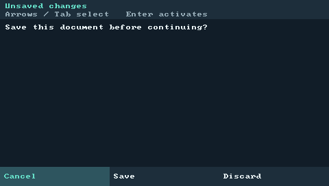

# USB hardware validation — 2026-09-12

This follow-up tested the current source on the owner's USB-connected PocketCHIP,
using its normal desktop account, existing Awesome/X11 session, and 480×272 display.
The device runs Debian 13.6, kernel `6.12.94+deb13-chip`, ARMv7 hard-float and SDL2
2.32.4. The cached SDL library used for cross-linking matched the device library's
SHA-256 exactly. No version was changed and no release assets were published.

## Device results

- Packaged all four freshly built ARM executables with the current helpers; the
  package tool's version probes executed the transferred binaries on the device.
  The installer also ran its actual OS, ABI, library and executable preflight.
- Preserved the old installation, desktop shortcut and configuration copies in a
  private rollback backup. The system PocketHome config, user PocketHome config
  and Awesome config stayed byte-identical through installation and removal.
  Existing App Center state was preserved. No original launcher was replaced.
- Repeated catalog discovery kept Terminal, Notepad and Files exactly once while
  retaining the other device entries. The pre-existing Get Help entry still
  diagnoses its missing `surf` executable; it was not silently removed or repaired.
- All three native apps launched, returned Home, resumed the same window, and
  closed back to Vitrallis. Three simultaneously running native apps also resumed
  without duplicate windows. Terminal executed commands with verified file output,
  interrupted a running `sleep` with Ctrl+C and accepted another command, then
  handled shell EOF and returned to the launcher.
- Notepad's unsaved confirmation defaulted to Cancel and retained the document;
  Save produced the exact expected file bytes. Files created a test directory,
  opened a text file through the shell's Notepad broker, renamed it, preserved it
  on default Cancel, and deleted it only after explicit confirmation.
- Three stop/relaunch cycles restored the original focus and exact Awesome
  keybinding objects. Killing the verified supervisor exercised real systemd
  cgroup cleanup and `ExecStopPost`; the original session and keys returned.
  The Exit Vitrallis tile also stopped the owned session and restored the desktop.
- A truncated bundle failed without changing the current generation or receipt.
  A missing Files executable retained a repair tile and allowed shell startup;
  the executable was restored afterward. Same-bundle reinstall passed.
- Offline uninstall's dry run left the running session intact. Actual removal
  stopped the session, removed managed executables/helpers, and preserved unknown
  test data and the original configurations. Reinstallation and launch passed.
- Brightness and volume changed through keyboard controls, were verified by
  sysfs/ALSA readback, and were restored to their initial values. Restart and
  power-off dialogs visibly selected Cancel; Enter cancelled them. Additional
  settings, timezone selection and update navigation were exercised with keys.
- The final ARM binaries passed native SDL smoke tests at 480×272 and 800×480.
- App Center's real Refresh completed with three published entries. The shell's
  real update check reported the unchanged beta2.6 version as up to date.
- A normal restart was explicitly confirmed in System Settings. After USB
  reconnected, a changed boot identity verified the reboot; the generation and
  original config bytes matched the pre-reboot snapshot. This device's existing
  startup configuration had already resumed Vitrallis. Notepad then passed a
  fresh launch/Home/resume/close round trip. The session was left active.

The prior installation, shortcut and original config copies remain in the private
device backup `~/.local/share/vitrallis-backups/usb-validation-20260912/`.

## Close-confirmation correction

The physical test exposed a pre-existing native UI defect: a window-manager close
request on an unsaved Notepad document returned immediately to the unchanged
editor instead of leaving its confirmation visible. Terminal had the same problem.
SDL's default behavior queues both a window-close event and a synthetic Quit for
its last window. The second event cancelled the newly opened modal dialog.

`crates/vitrallis-native/src/ui.rs` now sets `SDL_QUIT_ON_LAST_WINDOW_CLOSE=0`.
Native apps still handle window close and other legitimate Quit events, including
signals. The real device regression verified a persistent confirmation, default
Cancel preserving the document, and a second close with explicit Discard exiting.
The real Awesome simulator now repeats that unsaved-document flow.



## Rust safety and host validation

`sh scripts/validate.sh` passed again after the correction: formatting, workspace
check, strict Clippy, 194 Rust tests, 81 Python tests, source-archive rebuild,
installer/package fixtures, release builds, SDL smokes, script syntax, links and
whitespace. One pre-existing opt-in online catalog test remains ignored.

The required Rust commands were run through that gate with the lockfile enforced:

```sh
cargo fmt --all --check
cargo clippy --workspace --all-targets --all-features -- -D warnings -D clippy::all -D clippy::pedantic -D clippy::nursery -D clippy::cargo
cargo test --workspace --all-features
```

The same strict Clippy flags plus `-D clippy::undocumented_unsafe_blocks` and
`-D unsafe_op_in_unsafe_fn` passed on macOS, Linux, and the ARMv7 target. Review
added the missing macOS exclusive-rename safety comment in
`crates/vitrallis-native/src/files.rs`. The shell forbids unsafe code. The native
library and Terminal retain documented OS FFI for exclusive rename, user IDs,
PTY ownership, polling and process setup. Passing Clippy is not proof of memory
safety or a claim that the entire workspace and its dependencies contain no unsafe.

The complete Docker simulator passed again: Linux workspace/Python tests, real
Awesome session checks including the new close regression, and all 20 App Center
lifecycle scenarios. The ARM build used `scripts/build-armhf.sh` with the private,
device-matched SDL pkg-config directory. The final complete bundle digest is:

```text
5b46054b308c65c1843315370cb6cf6e9856d3665b0e670c8f5df82faaef73ea
```

The executing shell's `/proc` executable path and SHA-256 matched that installed
generation. All four binaries continue to report `0.1.0-beta2.6`.

## Bounded resource measurements

`scripts/measure-native.py --driver x11 --seconds 20 --samples 3` ran on the
device with a temporary home, real Terminal PTY and session inboxes. Warm startup
samples measure first frame plus exit, including process/loader overhead; they
do not measure interactive shell readiness. RSS excludes Terminal's child shell.

| App | First frame/exit median | Idle RSS | Idle CPU over 20 seconds |
| --- | ---: | ---: | ---: |
| Terminal | 531.58 ms | 6.38 MiB | 0.0% |
| Notepad | 840.53 ms | 6.23 MiB | 0.0% |
| Files | 732.10 ms | 6.25 MiB | 0.0% |

Zero CPU means no process CPU ticks were observed in this bounded sample.
No performance threshold or endurance claim is inferred from these measurements.

## Evidence and scope

Full local logs, scripts, raw display captures and packaged test builds are under
`target/usb-validation/`; simulator artifacts are under
`target/app-center-audit/docker/`. Two test-harness corrections were required:
waiting for systemd's complete stop state before checking `ExecStopPost`, and
using X11's `Next` keysym for Page Down. Neither required application changes.

Device UI input was injected through X11 on the actual display. This verifies
application behavior on real hardware, not the owner's physical touch/keypad
switches or calibration accuracy. Power-loss durability, destructive purge,
long-duration endurance, and installation from a newly published release are not
claimed. Current source requires the new helper asset inventory; published
beta2.6 assets remain unchanged and do not satisfy the current bootstrap contract.

The broader change inventory is in the earlier
[stock-session report](validation-stock-session.md#files-changed). This follow-up
also changes the shared native UI and safety comment, the simulator close test,
`docs/native-apps.md`, and the current device/validation reports. Historical
reports retain their original dates and scopes.
